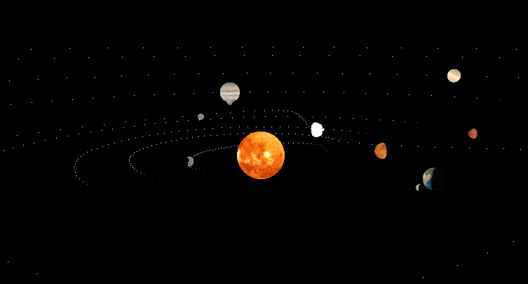

# Trabalho Prático de Computação Gráfica 2019/2020
The goal of this assignment is to develop a mini scene graph based 3D engine and provide usage examples that show its potential.

[Assignment](https://github.com/filipeguimaraes/CG1920/blob/master/assignment.PDF)

